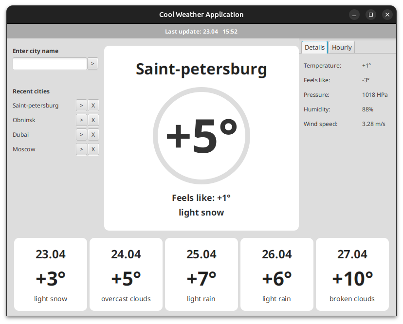

# Погодное приложение c UI на JavaFX

**Цель:** написать небольшой pet-project на ~1000 строк
### Функционал
- **Приложение показывает**
  - текущую погоду
  - детальный прогноз на день
  - прогноз на 5 дней вперед

- **Можно быстро переключится на другой ранее запрошенный город** (данные сохраняются после выхода из приложения)

- **В случае отсутствия доступа к интернету или API, можно восстановить старые данные** (приложение сообщит об этом)

- **Реализован простой кэш**: не делаются лишние запросы к API, если последний был послан недавно

### Технологии
- **JavaFX** для пользовательского интерфейса
- **Simple-JSON** для распаковки данных API и сохранения объектов в память
- **Open-Weather API** для получения данных о погоде
- **java.nio** для работы с файловой системой
- **java.net** для получения данных от API
- **LocalDateTimeAPI** для работы с датой и временем
- И такие возможности Java-Core, как **Reflection**, **Lambdas**, **StreamAPI** и т. д. 
